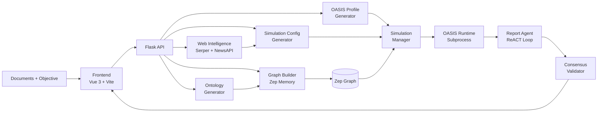
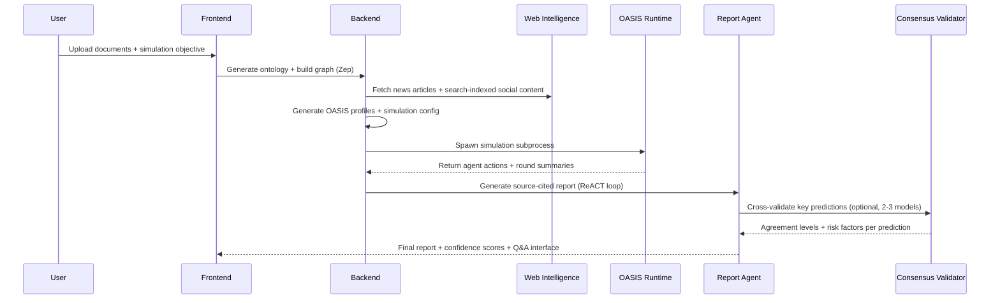

<div align="center">


# Phoring

### Open-Source Decision Intelligence · Document-to-Simulation · Source-Cited Forecasting

[](./LICENSE)
[](#quick-start)
[](#architecture)
[](#architecture)
[](#simulation-pipeline)
[](#security-hardening)
[](#quick-start)
[](#project-status)

**From raw documents to simulation-backed decisions — with live intelligence, multi-AI consensus, and source-cited forecasts.**

[Quick Start](#quick-start) · [Architecture](#architecture) · [API Reference](#api-surface) · [Roadmap](#roadmap)

</div>

---

## What Is Phoring?

Phoring is an **open-source decision intelligence platform** that transforms unstructured documents into executable multi-agent social simulations and delivers source-cited predictive reports.

You define a scenario in plain language and upload supporting documents. Phoring extracts a knowledge graph from those documents, builds realistic agent profiles, enriches the simulation with live news context, runs a multi-agent social dynamics simulation via [OASIS](https://github.com/camel-ai/oasis), and produces a structured report with inline citations and optional multi-model consensus validation.

```
Documents + Scenario Objective
         │
         ▼
  Knowledge Graph (Zep)
         │
         ▼
  Agent Profiles + Simulation Config
         │
         ▼
  OASIS / CAMEL Simulation
         │
         ▼
  Source-Cited Report + Q&A
```

**You provide:**
- Source files: `.pdf`, `.md`, `.txt`
- A simulation objective written in natural language

**Phoring produces:**
- A structured knowledge graph and ontology extracted from your documents
- Scenario-aligned OASIS agent profiles and simulation configuration
- Multi-agent social dynamics simulation output (Twitter and Reddit platforms)
- A source-cited report with confidence scoring, optional multi-AI consensus validation, and interactive Q&A

> _"Upload a document, describe a scenario, and get a fully sourced prediction report validated by multiple AI models."_

---

## Why It Exists

| Problem | What Phoring Does |
|---|---|
| Strategic decisions rely on static documents | Converts documents into dynamic simulation inputs enriched with live web data |
| Scenario intent gets lost between pipeline stages | Propagates `simulation_requirement` across graph build, agent profiles, config, and report |
| Simulations lack real-world context | Enriches agent context with news articles scraped at 4,000+ characters and search-indexed social content |
| Reports are hard to trust | Produces Perplexity-style inline source citations `[1][2][3]` with a full references section |
| Single-model hallucination risk | Multi-AI consensus validation cross-checks predictions across up to 3 independent LLM providers |
| Concurrent API calls corrupt simulation state | Atomic file writes with per-entity thread locks prevent partial-write corruption |

---

## How It Works



### Five-Step User Workflow

The frontend guides users through five sequential steps, each backed by a dedicated Vue component and API module:

| Step | Component | What Happens |
|---|---|---|
| **1 · Graph Build** | `Step1GraphBuild.vue` | Upload documents, generate ontology, build Zep knowledge graph |
| **2 · Environment Setup** | `Step2EnvSetup.vue` | Configure AI provider, select validators, set simulation parameters |
| **3 · Simulation** | `Step3Simulation.vue` | Execute OASIS simulation; monitor per-agent actions in real time |
| **4 · Report** | `Step4Report.vue` | View source-cited report with confidence scores; download as Markdown |
| **5 · Q&A** | `Step5Interaction.vue` | Ask follow-up questions answered by the Report Agent using graph tools |

---

## Simulation Pipeline



---

## Core Capabilities

### Knowledge Graph Construction
Uploaded documents are parsed (PDF, Markdown, plain text), chunked, and fed to an LLM-driven ontology generator that extracts named entities, relationships, and a domain ontology. These are stored as a standalone graph in **Zep Cloud**, which serves as the memory layer for agent profile generation and report Q&A tooling.

### OASIS Agent Profile Generation
Graph entities are converted into structured OASIS agent profiles — complete with persona, bio, MBTI, profession, interested topics, and platform-specific attributes (follower count, karma, etc.). The profile generator distinguishes individual agents from abstract or group entities and assigns stance-aware behavioral parameters aligned to the simulation objective.

### Web Intelligence Enrichment
Before simulation, the platform fetches live context via:

| Source | How It Works |
|---|---|
| **Serper** | Entity-formed Google Search queries; full article bodies scraped at 4,000+ characters |
| **NewsAPI** | Topic-specific news retrieval by keyword |
| **Search-indexed social content** | Site-specific Serper queries targeting Reddit, X/Twitter, Facebook, Instagram, LinkedIn, and TikTok as indexed by Google Search _(not direct platform API access)_ |

> **Note:** Social platform content is retrieved via Google Search (Serper `site:` queries), not through official platform APIs. Coverage and recency depend on search indexing.

### OASIS Simulation Runtime
Simulation is executed by spawning an OASIS subprocess managed by `simulation_runner.py`. The runner tracks per-agent actions, round progress, and runtime state across Twitter and Reddit platforms. Real-time action feeds are streamed back to the frontend during execution.

### Source-Cited Report Generation
The Report Agent operates in a **ReACT-style loop** over Zep graph tools, web intelligence, and simulation output. Every prediction is backed by inline citations:

> _"Consumer sentiment toward EV adoption has shifted positively `[1][2]`, though supply chain risks remain elevated `[3]`."_

A full **References** section with numbered URLs is appended automatically. Each report section receives a confidence level (HIGH / MEDIUM / LOW) based on citation count and evidence quality.

### Multi-AI Consensus Validation _(optional)_
Up to 3 independent LLM validators can be configured. Each scores predictions on logical coherence, historical precedent, completeness, and risk factors. The consensus engine assigns agreement levels per prediction:

```
Validator 1 (Primary)   Validator 2 (e.g. Claude)   Validator 3 (e.g. Gemini)
       │                         │                           │
       └─────────────────────────┴───────────────────────────┘
                                 ▼
                        Consensus Engine
                  ┌──────────────────────────┐
                  │  full_consensus          │
                  │  majority                │
                  │  split                   │
                  │  dissent                 │
                  └──────────────────────────┘
```

Validation is additive — it never modifies OASIS or CAMEL internals.

### Interactive Post-Report Q&A
After report generation, users can ask follow-up questions. The Report Agent answers using a combination of the report content, Zep graph search tools, and web intelligence — producing tool-augmented, cited responses rather than unconstrained LLM output.

---

## Security Hardening

The following security measures are implemented in the codebase:

### Input Validation & Path Traversal Protection

Every API endpoint validates ID parameters against strict regex patterns before any file system or database operation:

| ID Type | Pattern | Example |
|---|---|---|
| `project_id` | `^proj_[a-f0-9]{12}$` | `proj_a1b2c3d4e5f6` |
| `simulation_id` | `^sim_[a-f0-9]{12}$` | `sim_a1b2c3d4e5f6` |
| `report_id` | `^report_[a-f0-9]{12}$` | `report_a1b2c3d4e5f6` |
| `task_id` | `^task_[a-f0-9]{12}$` | `task_a1b2c3d4e5f6` |
| `graph_id` | `^[a-zA-Z0-9_-]{1,128}$` | `phoring_market_sim` |

`ProjectManager` and `SimulationManager` apply a second regex check at the file system boundary. Malformed IDs return `400 Bad Request` with a structured JSON error — never a stack trace.

### XSS Protection
All user-facing markdown rendering passes through **DOMPurify** before DOM insertion. `Step4Report.vue` and `Step5Interaction.vue` both sanitize `renderMarkdown()` output, preventing script injection via report content or chat responses.

### Debug Mode Disabled by Default
`FLASK_DEBUG` defaults to `False`. The Werkzeug debugger and interactive traceback are never exposed unless explicitly enabled via environment variable.

### Concurrent State Safety
Simulation and project state files are protected by **per-entity `threading.Lock`** instances with **atomic writes** (`tempfile.mkstemp` → `os.replace`). This prevents partial writes and corruption under concurrent API requests.

### Request Tracing
Every request receives a unique `X-Request-ID` (or inherits one provided by the caller). The ID propagates through all response headers and error payloads.

### Error Isolation
Internal exceptions are handled by a global Flask error handler stack:
- `ValidationError` → `400` with field-level detail
- Not Found → `404` with generic message
- Unhandled errors → `500` with opaque message (full traceback logged server-side only)

---

## Project Status

> **Early-stage open-source project.** Phoring is actively developed but not production-hardened. The following limitations apply:

| Area | Current State |
|---|---|
| **Storage** | Flat JSON files — no database backend |
| **Authentication** | None — suitable for local or trusted-network use only |
| **OASIS dependency** | Requires a working OASIS/CAMEL installation accessible to the subprocess runner |
| **Social content** | Retrieved via Google Search indexing, not live platform APIs |
| **Scalability** | Single-process Flask; not designed for high-concurrency deployments |
| **Test coverage** | Security smoke tests present (`test_fixes.py`); broader automated test suite is in progress |

Contributions, issue reports, and feedback are welcome.

---

## Quick Start

### Prerequisites
- Python 3.11+
- Node.js 18+ (20 LTS recommended)
- OASIS installed (see [OASIS repository](https://github.com/camel-ai/oasis))
- API keys: `LLM_API_KEY`, `ZEP_API_KEY` (required); `SERPER_API_KEY`, `NEWS_API_KEY` (recommended)

### 1. Install dependencies

```bash
# Frontend
cd frontend && npm install && cd ..

# Backend
python -m venv .venv
.venv\Scripts\python.exe -m pip install -r requirements.txt   # Windows
# source .venv/bin/activate && pip install -r requirements.txt  # macOS/Linux
```

### 2. Configure environment

Copy the example and fill in your keys:

```bash
cp .env.example .env
```

```env
# ── Primary LLM (required) ──────────────────────────────
LLM_API_KEY=your_openai_api_key
LLM_BASE_URL=https://api.openai.com/v1
LLM_MODEL_NAME=gpt-4o-mini

# ── Consensus Validator 2 (optional) ────────────────────
LLM_VALIDATOR_2_API_KEY=your_claude_api_key
LLM_VALIDATOR_2_BASE_URL=https://api.anthropic.com/v1
LLM_VALIDATOR_2_MODEL_NAME=claude-sonnet-4-20250514

# ── Consensus Validator 3 (optional) ────────────────────
LLM_VALIDATOR_3_API_KEY=your_gemini_api_key
LLM_VALIDATOR_3_BASE_URL=https://generativelanguage.googleapis.com/v1beta
LLM_VALIDATOR_3_MODEL_NAME=gemini-2.0-flash

# ── Knowledge Graph (required) ──────────────────────────
ZEP_API_KEY=your_zep_api_key

# ── Intelligence Sources (recommended) ──────────────────
SERPER_API_KEY=your_serper_api_key
NEWS_API_KEY=your_newsapi_key

# ── Optional ────────────────────────────────────────────
FLASK_DEBUG=false
CORS_ORIGINS=http://localhost:3000
```

### 3. Start the backend

```bash
.venv\Scripts\python.exe run.py        # Windows
# python run.py                         # macOS/Linux
# → http://localhost:5001/health
```

### 4. Start the frontend

```bash
cd frontend && npm run dev
# → Vite prints the local URL
```

### 5. Docker (single-command alternative)

```bash
docker compose up -d
# Frontend → http://localhost:3000
# Backend  → http://localhost:5001
```

### 6. Verify

```bash
curl http://localhost:5001/health
# → {"status":"ok","checks":{...}}
```

---

## API Surface

| Method | Endpoint | Purpose |
|---|---|---|
| `GET` | `/health` | Service health with dependency checks |
| `GET` | `/api/graph/project/<id>` | Retrieve project state |
| `POST` | `/api/graph/ontology/generate` | Generate ontology from uploaded documents |
| `POST` | `/api/graph/build` | Build knowledge graph in Zep |
| `DELETE` | `/api/graph/project/<id>` | Delete project and associated data |
| `GET` | `/api/simulation/entities/<graph_id>` | List entities in a graph |
| `POST` | `/api/simulation/*` | Simulation lifecycle endpoints |
| `GET` | `/api/report/validators` | List configured AI validators |
| `POST` | `/api/report/generate` | Start source-cited report generation |
| `POST` | `/api/report/generate/status` | Poll report generation task status |
| `GET` | `/api/report/<id>` | Retrieve a completed report |
| `GET` | `/api/report/<id>/download` | Download report as Markdown |
| `POST` | `/api/report/chat` | Interactive Q&A with Report Agent |
| `GET` | `/api/report/<id>/progress` | Real-time generation progress |
| `GET` | `/api/report/<id>/sections` | Stream completed report sections |
| `GET` | `/api/report/<id>/agent-log` | Agent execution log (JSONL) |

All ID parameters are validated against strict regex patterns — see [Security Hardening](#security-hardening).

---

## Repository Structure

```text
backend/
  app/
    __init__.py                        # Flask factory, global error handlers, request tracing
    config.py                          # Environment config, validator endpoints, DEBUG default
    api/
      graph.py                         # Graph / ontology / project endpoints
      simulation.py                    # Simulation entity + lifecycle endpoints
      report.py                        # Report generation, retrieval, chat, log endpoints
    models/
      project.py                       # Project persistence — per-entity locks + atomic writes
      task.py                          # Async task tracking
    services/
      consensus_validator.py           # Multi-AI prediction cross-validation engine
      graph_builder.py                 # Zep graph construction
      oasis_profile_generator.py       # OASIS agent profile generation from graph entities
      ontology_generator.py            # Ontology extraction from documents via LLM
      report_agent.py                  # ReACT-style report generation + confidence scoring
      simulation_config_generator.py   # Geopolitical-aware simulation config generation
      simulation_manager.py            # State management — locks + atomic writes
      simulation_runner.py             # OASIS subprocess bridge + action/round tracking
      web_intelligence.py              # Serper + NewsAPI article scraping + social search
      zep_entity_reader.py             # Graph entity extraction from Zep
      zep_tools.py                     # Graph search tools for Report Agent
    utils/
      validators.py                    # Strict ID regex validation + ValidationError
      file_parser.py                   # PDF / MD / TXT parsing
      llm_client.py                    # LLM client + validator discovery
      logger.py                        # Structured logging
      retry.py                         # Retry / backoff utilities

frontend/
  src/
    App.vue                            # Root app with error boundaries
    api/                               # Axios clients with retry/backoff
    components/
      Step1GraphBuild.vue              # Document upload + graph construction UI
      Step2EnvSetup.vue                # AI provider + simulation configuration UI
      Step3Simulation.vue              # Simulation execution monitor
      Step4Report.vue                  # Report viewer with DOMPurify sanitization
      Step5Interaction.vue             # Post-report Q&A with DOMPurify sanitization
      GraphPanel.vue                   # Knowledge graph visualization
      ErrorToast.vue                   # Global error toast
    stores/
      app.js                           # Pinia global state
    views/
      Home.vue                         # Landing page with pipeline visualization
```

---

## Engineering Principles

1. **Scenario continuity** — `simulation_requirement` propagates from upload through graph, profiles, config, simulation, report, and Q&A.
2. **Evidence grounding** — every prediction links back to source data via inline citations; the agent is not permitted to generate unsourced claims.
3. **Multi-model safety** — consensus validation catches single-model hallucination across independently configured validators.
4. **Defense in depth** — input validation at the API layer and again at the file system boundary.
5. **Atomic state** — thread locks + temp-file writes prevent corruption under concurrent requests.
6. **Additive integration** — OASIS/CAMEL internals are never modified; enrichment is layered on top via the subprocess bridge.

---

## Troubleshooting

### Backend exits immediately
1. Confirm `.env` exists at the repo root with `LLM_API_KEY` and `ZEP_API_KEY` set.
2. Use the project Python: `.venv\Scripts\python.exe run.py` (Windows) or activate venv on macOS/Linux.
3. Run from the repository root directory.

### `/health` returns 404
The health endpoint is at `http://localhost:5001/health`. The path `/api/health` does not exist — this is expected.

### Frontend fails to start
1. Run `npm install` inside the `frontend/` directory.
2. Node.js 18+ required (20 LTS recommended).
3. Run `npm run dev` from inside `frontend/`.

### 400 errors on valid-looking IDs
IDs must match exact patterns (e.g. `proj_` prefix followed by exactly 12 hex characters). Manually constructed IDs must conform to the regex patterns in [Security Hardening](#security-hardening).

### Port conflict on 5001
```powershell
netstat -ano | findstr :5001
taskkill /PID <pid> /F
```

---

## Roadmap

- [ ] Objective benchmark suite for simulation quality scoring
- [ ] Stage-level observability and richer runtime telemetry
- [ ] One-command preflight validation before simulation start
- [ ] Replay and post-run analysis interface
- [ ] Persistent database backend (replace JSON file storage)
- [ ] Authentication and authorization layer
- [ ] Real-time collaborative simulation sessions
- [ ] Plugin system for custom intelligence sources

---

## Acknowledgments

- [OASIS](https://github.com/camel-ai/oasis) — multi-agent social simulation framework by CAMEL-AI
- [CAMEL-AI](https://github.com/camel-ai) — communicative agent framework
- [Zep](https://www.getzep.com/) — knowledge graph memory service
- [DOMPurify](https://github.com/cure53/DOMPurify) — client-side XSS sanitization

---

## Security

If you discover a security vulnerability, please report it responsibly to **info@inbharat.ai**. Do not open a public issue for security concerns.

---

## Author

**Reeturaj Goswami** — Creator & Lead Developer
- Email: info@inbharat.ai
- GitHub: [@inbharatai](https://github.com/inbharatai)

---

## License

Licensed under the [MIT License](./LICENSE).

---

<div align="center">

**Built with purpose by [Reeturaj Goswami](https://github.com/inbharatai)**

For security inquiries: **info@inbharat.ai**

</div>
