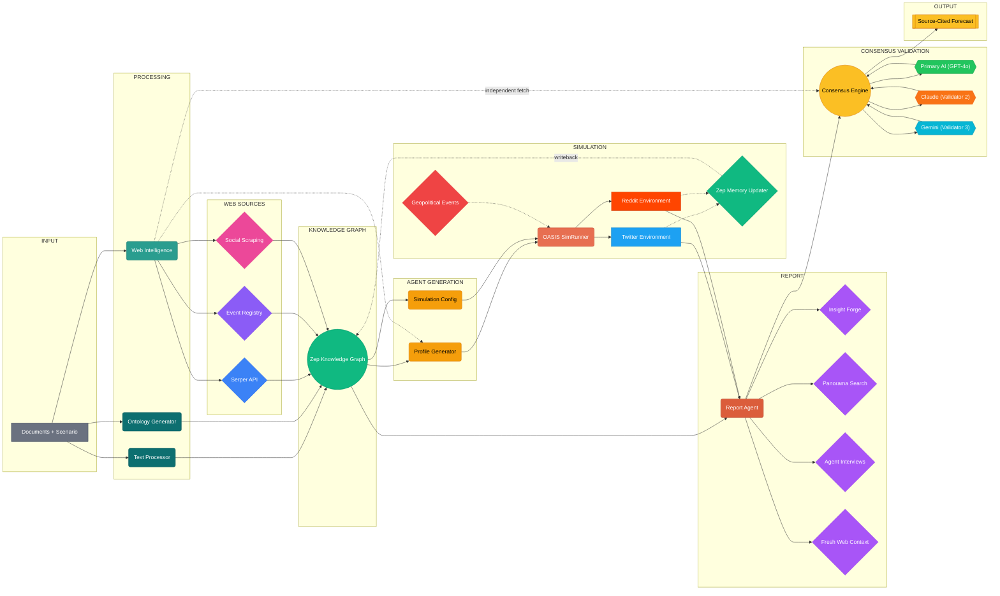
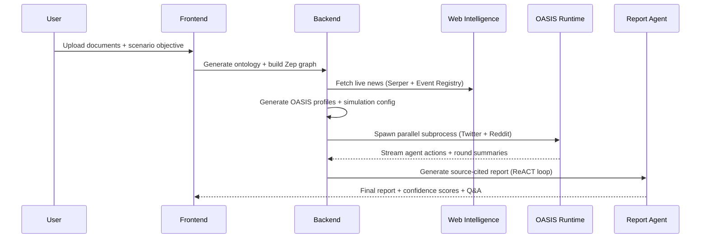

<div align="center">


# Phoring

### Document → Knowledge Graph → Multi-Agent Simulation → Source-Cited Forecast

[](./LICENSE)
[](#quick-start)
[](#architecture)
[](#simulation-engine)
[](#knowledge-graph)
[](#quick-start)
[](https://phoring.onrender.com)

**Upload documents. Describe a scenario. Get a simulation-backed, source-cited prediction report.**

[Live Demo](https://phoring.onrender.com) · [Quick Start](#quick-start) · [How It Works](#how-it-works) · [API Reference](#api-surface) · [Roadmap](#roadmap)

</div>

---

## What Is Phoring?

Phoring is an **open-source decision intelligence platform** that converts unstructured documents into multi-agent social simulations and delivers source-cited forecast reports.

Upload PDFs, Markdown, or plain text. Describe your scenario objective. Phoring extracts a knowledge graph, generates behaviorally-aligned agent profiles, enriches context with live web intelligence, runs a multi-agent simulation across Twitter and Reddit via [OASIS](https://github.com/camel-ai/oasis), and produces a structured report with inline citations and optional multi-model consensus validation.

```
Documents + Scenario Objective
         │
         ▼
  Knowledge Graph (Zep Cloud)
         │
         ▼
  Agent Profiles + Simulation Config
         │
         ├── Live News (Serper + Event Registry)
         │
         ▼
  OASIS Multi-Agent Simulation
    (Twitter + Reddit in parallel)
         │
         ▼
  Source-Cited Report + Consensus Validation + Q&A
```

**You provide:** source files (`.pdf`, `.md`, `.txt`) and a scenario objective in plain language.

**Phoring produces:**
- A domain ontology and knowledge graph extracted from your documents
- Persona-rich OASIS agent profiles aligned to your scenario
- A parallel Twitter + Reddit multi-agent simulation with real-time action streaming
- A source-cited prediction report with confidence scoring, optional multi-AI consensus validation, and interactive Q&A

---

## Live Demo

**[phoring.onrender.com](https://phoring.onrender.com)**

Deployed on Render (Docker, Pro plan). Upload a document, walk through the five-step pipeline, and get a simulation-backed forecast. No local setup required.

---

## Why It Exists

| Problem | What Phoring Does |
|---|---|
| Strategic decisions rely on static documents | Converts documents into dynamic simulation inputs enriched with live news context |
| Scenario intent gets lost between pipeline stages | Propagates `simulation_requirement` end-to-end — graph → profiles → config → simulation → report |
| Simulations lack real-world context | Injects geopolitical events sourced from Serper + Event Registry with full article scraping |
| Reports are hard to trust | Produces inline source citations `[1][2][3]` with a numbered references section |
| Single-model hallucination risk | Multi-AI consensus validation cross-checks predictions across up to 3 independent LLM providers |
| Interrupted simulations are lost | Auto-restarts simulations that were interrupted by server restarts or OOM events |

---

## How It Works

> **Interactive 3D version** of this graph available on the [live demo](https://phoring.onrender.com)



**28 nodes · 38 edges · 8 architectural layers** — solid lines show primary data flow, dashed lines show secondary enrichment and feedback loops.

### Five-Step Pipeline

| Step | What Happens |
|---|---|
| **1 · Graph Build** | Upload documents → generate domain ontology → build Zep knowledge graph |
| **2 · Environment Setup** | Configure LLM provider, select validators, set simulation speed mode |
| **3 · Simulation** | Execute parallel OASIS simulation (Twitter + Reddit); monitor per-agent actions in real time |
| **4 · Report** | View source-cited forecast with confidence scores; download as Markdown |
| **5 · Q&A** | Ask follow-up questions answered by the Report Agent using graph tools + web intelligence |

---

## Simulation Engine

Simulations run as **isolated subprocesses** managed by the backend. The runner tracks per-agent actions, round progress, and platform-specific state across Twitter and Reddit in parallel.



**Key runtime features:**
- **Parallel execution**: Twitter and Reddit simulations run concurrently via `asyncio.gather()`
- **Real-time streaming**: Agent actions are streamed to the frontend via JSONL action logs polled every 2 seconds
- **Stall detection**: Adaptive timeout (15 min base + 30s per agent, capped at 45 min) auto-kills stuck simulations
- **Auto-restart on crash**: If the backend restarts mid-simulation (OOM, deploy), orphaned simulations are automatically relaunched from saved parameters
- **Speed modes**: `normal` (full fidelity), `fast` (~24 rounds), `express` (~12 rounds)

---

## Core Capabilities

### Knowledge Graph
Documents are parsed, chunked, and processed through an LLM-driven ontology generator that extracts entities, relationships, and domain structure. These are stored as a graph in **Zep Cloud**, serving as the memory layer for profile generation, simulation context, and report Q&A.

### Web Intelligence
Before simulation, the platform fetches live context from multiple sources:

| Source | Method |
|---|---|
| **Serper** | Google Search queries → full article bodies scraped at 4,000+ characters |
| **Event Registry** | Geopolitical event articles via `eventregistry.org` API (7-day recency window) |
| **Social content** | Site-specific Serper `site:` queries targeting Reddit, X/Twitter, Facebook, Instagram, LinkedIn, TikTok as indexed by Google Search |

> **Note:** Social platform content is retrieved via Google Search indexing, not direct platform APIs.

### Agent Profile Generation
Graph entities are converted into structured OASIS agent profiles with persona, bio, MBTI, profession, interests, and platform-specific attributes (follower count, karma, etc.). The generator distinguishes individuals from abstract entities and assigns stance-aware behavioral parameters aligned to the scenario objective.

### Source-Cited Reports
The Report Agent uses a **ReACT-style loop** over Zep graph tools, web intelligence, and simulation output. Every prediction is backed by inline citations:

> _"Consumer sentiment toward EV adoption has shifted positively `[1][2]`, though supply chain risks remain elevated `[3]`."_

Each section receives a confidence level (HIGH / MEDIUM / LOW) based on citation density and evidence quality. A full references section with numbered URLs is appended.

### Multi-AI Consensus Validation
Up to 3 independent LLM validators score predictions on logical coherence, historical precedent, completeness, and risk factors:

```
Primary LLM          Validator 2 (Claude)     Validator 3 (Gemini)
     │                      │                        │
     └──────────────────────┴────────────────────────┘
                            ▼
                   Consensus Engine
             ┌─────────────────────────┐
             │  full_consensus         │
             │  majority               │
             │  split                  │
             │  dissent                │
             └─────────────────────────┘
```

Validation is additive — it never modifies OASIS or CAMEL internals.

---

## Security

| Layer | Implementation |
|---|---|
| **Input validation** | Strict regex on all ID parameters (`^proj_[a-f0-9]{12}$`, etc.) at API and filesystem boundary |
| **Path traversal** | Double-check regex validation in `ProjectManager` and `SimulationManager` |
| **XSS protection** | All markdown rendering passes through DOMPurify before DOM insertion |
| **Concurrent state** | Per-entity `threading.Lock` with atomic writes (`tempfile.mkstemp` → `os.replace`) |
| **Error isolation** | Global Flask error handlers — internal tracebacks logged server-side only, never exposed |
| **Request tracing** | Every request receives a unique `X-Request-ID` propagated through response headers |
| **Debug mode** | `FLASK_DEBUG` defaults to `False` — Werkzeug debugger never exposed in production |

For security vulnerabilities, contact **info@inbharat.ai** — do not open public issues.

---

## Quick Start

### Prerequisites
- Python 3.11+
- Node.js 18+ (20 LTS recommended)
- API keys: `LLM_API_KEY`, `ZEP_API_KEY` (required); `SERPER_API_KEY`, `NEWS_API_KEY` (recommended)

### 1. Install dependencies

```bash
# Frontend
cd frontend && npm install && cd ..

# Backend
python -m venv .venv
.venv/bin/pip install -r requirements.txt        # macOS/Linux
.venv\Scripts\pip install -r requirements.txt     # Windows
```

### 2. Configure environment

```bash
cp .env.example .env
# Edit .env with your API keys
```

Required keys:
```env
LLM_API_KEY=your_openai_api_key
LLM_BASE_URL=https://api.openai.com/v1
LLM_MODEL_NAME=gpt-4o-mini
ZEP_API_KEY=your_zep_api_key
```

Optional (recommended):
```env
SERPER_API_KEY=your_serper_key          # Web intelligence
NEWS_API_KEY=your_newsapi_key           # News enrichment
SIMULATION_SPEED_MODE=normal            # normal | fast | express
ENABLE_GEOPOLITICAL_EVENTS=true         # Inject real-time geopolitical events
```

Optional (multi-AI consensus):
```env
LLM_VALIDATOR_2_API_KEY=your_claude_key
LLM_VALIDATOR_2_BASE_URL=https://api.anthropic.com/v1
LLM_VALIDATOR_2_MODEL_NAME=claude-sonnet-4-20250514

LLM_VALIDATOR_3_API_KEY=your_gemini_key
LLM_VALIDATOR_3_BASE_URL=https://generativelanguage.googleapis.com/v1beta/openai
LLM_VALIDATOR_3_MODEL_NAME=gemini-2.0-flash
```

### 3. Run

```bash
# Backend (http://localhost:5001)
python run.py

# Frontend (http://localhost:3000)
cd frontend && npm run dev
```

### 4. Docker (single command)

```bash
docker compose up -d
# → http://localhost:3000 (frontend)
# → http://localhost:5001 (backend)
```

### 5. Verify

```bash
curl http://localhost:5001/health
# → {"status":"ok","checks":{...}}
```

---

## API Surface

| Method | Endpoint | Purpose |
|---|---|---|
| `GET` | `/health` | Service health with dependency status |
| `POST` | `/api/graph/ontology/generate` | Generate ontology from uploaded documents |
| `POST` | `/api/graph/build` | Build knowledge graph in Zep |
| `GET` | `/api/graph/project/<id>` | Retrieve project state |
| `GET` | `/api/graph/data/<graph_id>` | Retrieve graph data for visualization |
| `DELETE` | `/api/graph/project/<id>` | Delete project and associated data |
| `GET` | `/api/simulation/entities/<graph_id>` | List entities in a graph |
| `POST` | `/api/simulation/prepare` | Generate profiles + simulation config |
| `POST` | `/api/simulation/start` | Launch OASIS simulation subprocess |
| `GET` | `/api/simulation/<id>/run-status` | Lightweight progress polling |
| `GET` | `/api/simulation/<id>/run-status/detail` | Full status + recent actions |
| `POST` | `/api/simulation/stop` | Stop a running simulation |
| `POST` | `/api/report/generate` | Start source-cited report generation |
| `GET` | `/api/report/<id>` | Retrieve completed report |
| `GET` | `/api/report/<id>/download` | Download report as Markdown |
| `POST` | `/api/report/chat` | Interactive Q&A with Report Agent |
| `GET` | `/api/report/<id>/progress` | Real-time generation progress |
| `GET` | `/api/report/validators` | List configured AI validators |

All ID parameters are validated against strict regex patterns — malformed IDs return `400`.

---

## Tech Stack

| Layer | Technology |
|---|---|
| **Frontend** | Vue 3 + Vite + Pinia |
| **Backend** | Flask (Python 3.11+) |
| **Simulation** | OASIS 0.2.5 + CAMEL-AI 0.2.78 |
| **Knowledge Graph** | Zep Cloud 3.13.0 |
| **Web Intelligence** | Serper API + Event Registry |
| **LLM** | Any OpenAI SDK-compatible provider (default: GPT-4o-mini) |
| **Deployment** | Docker (multi-stage build) · Render |
| **CI** | GitHub → Render auto-deploy on push |

---

## Project Status

Phoring is actively developed. Current limitations:

| Area | State |
|---|---|
| **Storage** | File-based JSON — no database backend yet |
| **Authentication** | None — suitable for local or trusted-network use |
| **Social content** | Via Google Search indexing, not direct platform APIs |
| **Scalability** | Single-process Flask; not designed for high-concurrency |

---

## Roadmap

- [ ] Persistent database backend (replace JSON file storage)
- [ ] Authentication and authorization layer
- [ ] Objective benchmark suite for simulation quality scoring
- [ ] Stage-level observability and richer runtime telemetry
- [ ] Replay and post-run analysis interface
- [ ] Plugin system for custom intelligence sources
- [ ] Real-time collaborative sessions

---

## Repository Structure

```
backend/
  app/
    __init__.py              Flask factory, error handlers, SPA serving
    config.py                Environment config, speed modes, validation
    api/
      graph.py               Graph / ontology / project endpoints
      simulation.py          Simulation lifecycle endpoints
      report.py              Report generation, chat, streaming
    services/
      graph_builder.py       Zep graph construction
      ontology_generator.py  Ontology extraction via LLM
      oasis_profile_generator.py  Agent profile generation
      simulation_config_generator.py  Geopolitical-aware config generation
      simulation_runner.py   OASIS subprocess manager + auto-restart
      simulation_manager.py  State management with atomic writes
      web_intelligence.py    Serper + Event Registry scraping
      report_agent.py        ReACT-style report generation
      consensus_validator.py Multi-AI cross-validation engine
      zep_entity_reader.py   Graph entity extraction
      zep_tools.py           Graph search tools for Report Agent
    utils/
      validators.py          Strict ID regex validation
      file_parser.py         PDF / MD / TXT parsing
      llm_client.py          LLM client wrapper
  scripts/
    run_parallel_simulation.py   OASIS parallel runner (Twitter + Reddit)

frontend/
  src/
    components/
      Step1GraphBuild.vue    Document upload + graph construction
      Step2EnvSetup.vue      LLM + simulation configuration
      Step3Simulation.vue    Real-time simulation monitor
      Step4Report.vue        Source-cited report viewer
      Step5Interaction.vue   Post-report Q&A interface
      GraphPanel.vue         Knowledge graph visualization
```

---

## Acknowledgments

- [OASIS](https://github.com/camel-ai/oasis) — Multi-agent social simulation framework
- [CAMEL-AI](https://github.com/camel-ai) — Communicative agent framework
- [Zep](https://www.getzep.com/) — Knowledge graph memory service

---

## Author

**Reeturaj Goswami** — Creator & Lead Developer
- Email: info@inbharat.ai
- GitHub: [@inbharatai](https://github.com/inbharatai)

---

## License

[MIT License](./LICENSE)

---

<div align="center">

**Built by [Reeturaj Goswami](https://github.com/inbharatai)** · [Live Demo](https://phoring.onrender.com) · info@inbharat.ai

</div>
