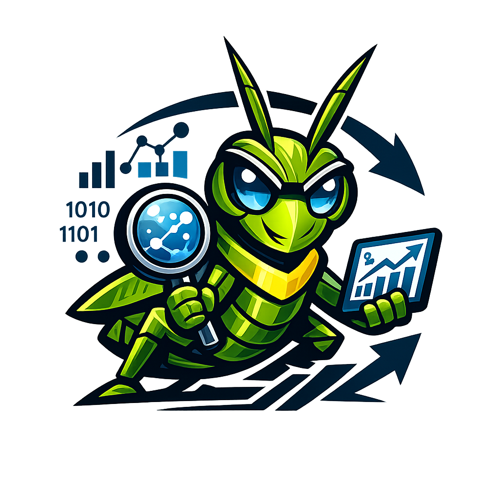
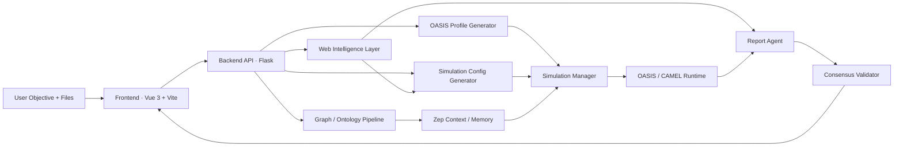
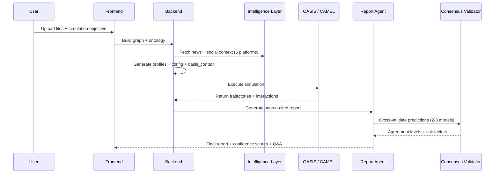

<div align="center">



# Phoring

### The World's First Open-Source Decision Intelligence Engine for Scenario Simulation & Predictive Forecasting

[](./LICENSE)
[](#quick-start)
[](#architecture)
[](#architecture)
[](#simulation-pipeline)
[](#security-hardening)
[](#quick-start)

**From raw documents to simulation-backed decisions — with live intelligence, multi-AI consensus, and source-cited forecasts.**

[Getting Started](#quick-start) | [Architecture](#architecture) | [API Docs](#api-surface) | [Roadmap](#roadmap)

---

`#DecisionIntelligence` `#SwarmIntelligence` `#AgentSimulation` `#PredictiveAI` `#MultiAgentSystems` `#AIForecasting` `#OASIS` `#CAMEL` `#KnowledgeGraph` `#OpenSource` `#ScenarioPlanning` `#AIConsensus` `#SocialSimulation` `#WebIntelligence` `#PhoringAI`

</div>

---

## What Is Phoring

Phoring is a **production-grade, end-to-end decision intelligence platform** that transforms unstructured documents into executable multi-agent social simulations and delivers actionable, source-cited forecasting reports — powered by swarm intelligence, live web data, and multi-AI consensus validation.

**You provide:**
1. Source files (`.pdf`, `.md`, `.txt`)
2. A simulation objective in natural language

**Phoring delivers:**
1. Structured knowledge graph and ontology context
2. Scenario-aligned agent profiles and simulation configuration
3. Multi-agent social dynamics simulation (OASIS / CAMEL)
4. Source-cited report with confidence scoring, multi-AI consensus validation, and interactive Q&A

> **Think of it as:** _"Upload a document, describe a scenario, and get a fully sourced prediction report validated by multiple AI models — in minutes, not weeks."_

---

## Why It Matters

| Challenge | How Phoring Solves It |
|---|---|
| Strategic decisions rely on static documents | Converts documents into dynamic simulation inputs enriched with live data |
| Scenario intent gets lost between pipeline stages | Propagates `simulation_requirement` across graph build, profiles, config, and report |
| Simulations ignore live external context | Enriches with web intelligence from 4,000+ char articles and 6 social platforms |
| Reports are hard to trust | Produces **Perplexity-style source citations `[1][2][3]`** with full reference URLs |
| Single-model hallucination risk | **Multi-AI consensus validation** cross-checks predictions across 2-3 independent models |
| Race conditions corrupt simulation state | **Atomic file writes** with per-entity thread locks prevent data corruption |

---

## Core Platform Capabilities

1. **Graph & ontology generation** from uploaded evidence via Zep memory graphs.
2. **OASIS profile & environment creation** for multi-agent simulation with stance-aware dual dynamics.
3. **Live intelligence enrichment** using Serper, NewsAPI, and cross-platform social mining (Reddit, X/Twitter, Facebook, Instagram, LinkedIn, TikTok).
4. **Geopolitical & disruption-aware** simulation configuration with event injection.
5. **Source-cited report synthesis** with inline references, confidence scoring, and timeframe validation.
6. **Multi-AI consensus validation** — cross-validates predictions across up to 3 independent LLM providers.
7. **Interactive post-report Q&A** via Report Agent with tool-augmented answers.
8. **Security-hardened API layer** with input validation, XSS protection, and request tracing.

---

## Architecture



---

## Simulation Pipeline



---

## Intelligence Features

### Source-Cited Forecasts
Every prediction in the generated report is backed by **inline source citations** in Perplexity style:

> *"Consumer sentiment toward EV adoption has shifted positively `[1][2]`, though supply chain risks remain elevated `[3]`."*

The report footer contains a full **References** section with numbered URLs linking back to the original news articles, social posts, and data sources.

**Implementation:** `report_agent.py` accumulates sources during web intelligence and social mining tool calls, assigns sequential `[N]` markers, and builds the references section automatically.

### Multi-AI Consensus Validation
Reports can be cross-validated by **up to 3 independent AI models** to detect single-model hallucination and strengthen prediction confidence:

```
┌─────────────────┐    ┌──────────────────┐    ┌──────────────────┐
│  Validator 1     │    │  Validator 2      │    │  Validator 3      │
│  (Primary LLM)   │    │  (e.g. Claude)    │    │  (e.g. Gemini)    │
└────────┬────────┘    └────────┬─────────┘    └────────┬─────────┘
         │                      │                       │
         └──────────┬───────────┘───────────────────────┘
                    ▼
           Consensus Engine
      ┌──────────────────────┐
      │ full_consensus       │
      │ majority             │
      │ split                │
      │ dissent              │
      └──────────────────────┘
```

Each prediction is scored independently on **logical coherence**, **historical precedent**, **completeness**, and **risk factors**. The consensus engine then assigns an agreement level per prediction and an overall validation summary that is appended to the report.

**Configuration:** Enable via `consensus_config` when generating a report. Validator endpoints are configured through environment variables (see below).

### Confidence Scoring
Every report section receives a confidence level:

| Level | Criteria |
|---|---|
| **HIGH** | 3+ independent data points corroborate the prediction |
| **MEDIUM** | 1-2 supporting data points available |
| **LOW** | Extrapolated from limited or indirect evidence |

The scoring engine counts tool-sourced citations and penalizes sections that flag data limitations. A summary is appended to the final report with explicit evidence counts.

### Timeframe Coverage Validation
The report agent detects temporal expressions in the simulation objective (*"by Friday"*, *"next week"*, *"in 30 days"*) and validates whether the generated report explicitly addresses the requested timeframe. A warning is appended if coverage gaps are detected.

### Live Intelligence Sources
| Source | Method |
|---|---|
| Serper | Entity-formed search queries, 4,000+ char article scraping |
| NewsAPI | Topic-specific news retrieval |
| Reddit | Subreddit-level social sentiment |
| X / Twitter | Post and trend analysis |
| Facebook | Public page and group signals |
| Instagram | Visual and caption sentiment |
| LinkedIn | Professional and industry discourse |
| TikTok | Trending content and reaction signals |

---

## Security Hardening

All security measures below are **implemented and tested** (27/27 test cases passing).

### Input Validation & Path Traversal Protection
Every API endpoint validates ID parameters against strict regex patterns before any file system or database operation:

| ID Type | Pattern | Example |
|---|---|---|
| `project_id` | `^proj_[a-f0-9]{12}$` | `proj_a1b2c3d4e5f6` |
| `simulation_id` | `^sim_[a-f0-9]{12}$` | `sim_a1b2c3d4e5f6` |
| `report_id` | `^report_[a-f0-9]{12}$` | `report_a1b2c3d4e5f6` |
| `task_id` | `^task_[a-f0-9]{12}$` | `task_a1b2c3d4e5f6` |
| `graph_id` | `^[a-zA-Z0-9_-]{1,128}$` | `phoring_market_sim` |

**Defense in depth:** File path construction in `ProjectManager` and `SimulationManager` includes secondary regex checks, rejecting any ID that doesn't match `^[a-zA-Z0-9_-]+$` even if it passes the API layer.

Malformed IDs return `400 Bad Request` with a structured JSON error — never a stack trace.

### XSS Protection
All user-facing markdown rendering in the frontend passes through **DOMPurify** before DOM insertion. Both `Step4Report.vue` and `Step5Interaction.vue` sanitize `renderMarkdown()` output, preventing script injection through report content or chat responses.

### Debug Mode Disabled by Default
`FLASK_DEBUG` defaults to `False`. The Werkzeug debugger and interactive traceback are **never exposed** unless the operator explicitly sets `FLASK_DEBUG=true` in the environment.

### Concurrent State Safety
Simulation and project state files are protected by **per-entity `threading.Lock`** instances with **atomic writes** (`tempfile.mkstemp` → `os.replace`). This prevents partial writes and corruption under concurrent API requests.

### Request Tracing
Every request receives a unique `X-Request-ID` (or respects an externally provided one). The ID appears in all response headers and error payloads, enabling end-to-end correlation across logs.

### Error Isolation
Internal exceptions are caught by a global Flask error handler stack:
- `ValidationError` → `400` with field-level detail
- Not Found → `404` with generic message
- Unhandled errors → `500` with opaque message (full traceback logged server-side only)

---

## Quick Start

### 1. Install dependencies

```bash
# frontend
cd frontend && npm install && cd ..

# backend (use a local venv)
python -m venv .venv
.venv\Scripts\python.exe -m pip install -r requirements.txt
```

### 2. Configure environment

Create a root `.env` file (see [Environment Variables](#environment-variables)).

### 3. Start backend

```bash
.venv\Scripts\python.exe run.py
# → http://localhost:5001/health
```

### 4. Start frontend

```bash
cd frontend && npm run dev
# → follow the Vite URL printed in terminal
```

### 5. Docker (alternative)

```bash
docker compose up -d
# → http://localhost:3000 (frontend) + http://localhost:5001 (backend)
```

### 6. Validate

```bash
curl http://localhost:5001/health
# → {"status":"ok","checks":{...}}
```

---

## Environment Variables

Create a root `.env` file:

```env
# ── Primary LLM (required) ──────────────────────────────
LLM_API_KEY=your_openai_api_key
LLM_BASE_URL=https://api.openai.com/v1
LLM_MODEL_NAME=gpt-4o-mini

# ── Consensus Validator 2 (optional) ────────────────────
LLM_VALIDATOR_2_API_KEY=your_claude_api_key
LLM_VALIDATOR_2_BASE_URL=https://api.anthropic.com/v1
LLM_VALIDATOR_2_MODEL_NAME=claude-sonnet-4-20250514

# ── Consensus Validator 3 (optional) ────────────────────
LLM_VALIDATOR_3_API_KEY=your_gemini_api_key
LLM_VALIDATOR_3_BASE_URL=https://generativelanguage.googleapis.com/v1beta
LLM_VALIDATOR_3_MODEL_NAME=gemini-2.0-flash

# ── Knowledge Graph ─────────────────────────────────────
ZEP_API_KEY=your_zep_api_key

# ── Intelligence Sources ────────────────────────────────
SERPER_API_KEY=your_serper_api_key
NEWS_API_KEY=your_newsapi_key

# ── Optional ────────────────────────────────────────────
FLASK_DEBUG=false
CORS_ORIGINS=http://localhost:3000
```

---

## API Surface

| Method | Endpoint | Purpose |
|---|---|---|
| `GET` | `/health` | Service health with dependency checks |
| `GET` | `/api/graph/project/<id>` | Retrieve project state |
| `POST` | `/api/graph/ontology/generate` | Generate ontology from documents |
| `POST` | `/api/graph/build` | Build knowledge graph |
| `DELETE` | `/api/graph/project/<id>` | Delete project |
| `GET` | `/api/simulation/entities/<graph_id>` | List graph entities |
| `POST` | `/api/simulation/*` | Simulation lifecycle endpoints |
| `GET` | `/api/report/validators` | List available AI validators |
| `POST` | `/api/report/generate` | Generate source-cited report |
| `POST` | `/api/report/generate/status` | Poll report generation progress |
| `GET` | `/api/report/<id>` | Retrieve completed report |
| `GET` | `/api/report/<id>/download` | Download report as Markdown |
| `POST` | `/api/report/chat` | Interactive Q&A with Report Agent |
| `GET` | `/api/report/<id>/progress` | Real-time generation progress |
| `GET` | `/api/report/<id>/sections` | Stream completed sections |
| `GET` | `/api/report/<id>/agent-log` | Agent execution log |

All endpoints with ID parameters enforce strict regex validation — see [Security Hardening](#security-hardening).

---

## Repository Map

```text
backend/
  app/
    __init__.py                        # Flask factory, global error handlers, request tracing
    config.py                          # Environment config, validator endpoints, DEBUG default
    api/
      graph.py                         # Graph/ontology/project endpoints
      simulation.py                    # Simulation entity + lifecycle endpoints
      report.py                        # Report generation, retrieval, chat, log endpoints
    models/
      project.py                       # Project persistence with per-entity locks + atomic writes
      task.py                          # Async task tracking
    services/
      consensus_validator.py           # Multi-AI prediction cross-validation engine
      graph_builder.py                 # Zep graph construction
      oasis_profile_generator.py       # Agent profile generation
      ontology_generator.py            # Ontology extraction from documents
      report_agent.py                  # Source-cited report generation + confidence scoring
      simulation_config_generator.py   # Geopolitical-aware simulation config
      simulation_manager.py            # State management with locks + atomic writes
      simulation_runner.py             # OASIS/CAMEL runtime bridge
      web_intelligence.py              # News + 6-platform social mining
      zep_entity_reader.py             # Graph entity extraction
      zep_tools.py                     # Graph search tools for Report Agent
    utils/
      validators.py                    # Strict ID regex validation + ValidationError
      file_parser.py                   # PDF/MD/TXT parsing
      llm_client.py                    # LLM client + validator discovery
      logger.py                        # Structured logging
      retry.py                         # Retry/backoff utilities

frontend/
  src/
    App.vue                            # Root app with error boundaries
    api/                               # Axios clients with retry/backoff
    components/
      Step1GraphBuild.vue              # Document upload + graph construction
      Step2EnvSetup.vue                # AI provider + simulation configuration
      Step3Simulation.vue              # Simulation execution monitor
      Step4Report.vue                  # Report viewer with DOMPurify sanitization
      Step5Interaction.vue             # Post-report Q&A with DOMPurify sanitization
      GraphPanel.vue                   # Knowledge graph visualization
      ErrorToast.vue                   # Global error toast
    stores/
      app.js                           # Pinia global state
    views/
      Home.vue                         # Landing page with pipeline visualization
```

---

## Troubleshooting

### Backend exits with code 1
1. Confirm `.env` contains required keys (`LLM_API_KEY`, `ZEP_API_KEY`).
2. Use project Python: `.venv\Scripts\python.exe`.
3. Start from the repository root folder.

### Health endpoint returns unexpected 404
- Correct path: `http://localhost:5001/health`
- `/api/health` does not exist — this is expected.

### Frontend startup failure
1. Run `npm install` in `frontend/`.
2. Requires Node.js 18+ (20 LTS recommended).
3. Restart with `npm run dev`.

### 400 errors on valid-looking IDs
IDs must match exact patterns (e.g. `proj_` prefix + 12 hex chars). If you are using manually constructed IDs, ensure they conform to the regex patterns listed in [Security Hardening](#security-hardening).

### Port conflicts
```powershell
netstat -ano | findstr :5001
taskkill /PID <pid> /F
```

---

## Engineering Principles

1. **Scenario continuity** — `simulation_requirement` propagates from upload through graph, profiles, config, simulation, report, and Q&A.
2. **Evidence grounding** — every prediction links back to source data via inline citations.
3. **Multi-model safety** — consensus validation catches single-model hallucination.
4. **Defense in depth** — input validation at API layer AND at file system boundary.
5. **Atomic state** — thread locks + temp-file writes prevent corruption under concurrency.
6. **Additive integration** — OASIS/CAMEL internals are never modified; enrichment is layered on top.

---

## Roadmap

- [ ] Objective benchmark suite for simulation quality scoring
- [ ] Stage-level observability and richer runtime telemetry
- [ ] One-command preflight validation before simulation execution
- [ ] Replay and deep post-run analysis UX
- [ ] Persistent database backend to replace JSON file storage
- [ ] Authentication and authorization layer
- [ ] Real-time collaborative simulation sessions
- [ ] Plugin system for custom intelligence sources

---

## Acknowledgments

- [OASIS](https://github.com/camel-ai/oasis) — multi-agent social simulation framework
- [CAMEL-AI](https://github.com/camel-ai) — communicative agent framework
- [Zep](https://www.getzep.com/) — knowledge graph memory
- [DOMPurify](https://github.com/cure53/DOMPurify) — XSS sanitization

---

## Security

If you discover a security vulnerability, please report it responsibly to **info@inbharat.ai**. Do not open a public issue for security concerns.

---

## Author

**Reeturaj Goswami** — Creator & Lead Developer
- Email: info@inbharat.ai
- GitHub: [@inbharatai](https://github.com/inbharatai)

---

## License

Licensed under [AGPL-3.0](./LICENSE).

---

<div align="center">

**Built with purpose by [Reeturaj Goswami](https://github.com/inbharatai) & the Phoring Team**

For security inquiries: **info@inbharat.ai**

`#PhoringAI` `#PredictAnything` `#SimulateTheFuture`

</div>
